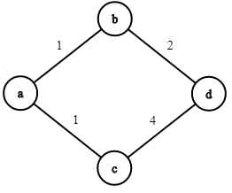

# ShortestPathAlgorithms 
This ```.NETStandart 2.1``` library implements Dijkstra pathfinding algorithm.

## Getting Started
Here`s an example how to use this lib.
### Add namespaces:
```C#
using Pathfinding.Models; //Add Graph and other models
using Pathfinding.Algoritms; //Graph extensions 
```
### Greate graph:
```C#
var a = new Vertex<string>() { Data = "a" };
var b = new Vertex<string>() { Data = "b" };
var c = new Vertex<string>() { Data = "c" };
var d = new Vertex<string>() { Data = "d" };

var ab = new Edge<string>() { StartNode = a, EndNode = b, Distance = 1 };
var bd = new Edge<string>() { StartNode = b, EndNode = d, Distance = 2 };
var ac = new Edge<string>() { StartNode = a, EndNode = c, Distance = 1 };
var cd = new Edge<string>() { StartNode = c, EndNode = d, Distance = 4 };
// 1      2
//a-b -> b-d 
//
// 1      4
//a-c -> c-d

var graph = new Graph<string>();
graph.Vertices = new HashSet<IVertex<string>>(new[] { a, b, c, d });
graph.Edges = new HashSet<IEdge<string>>(new[] { ab, bd, ac, cd });
```

### Find shortest path for created graph:
```C#
var shortestPath = graph.FindShortestPath(a, d);
foreach (var edge in shortestPath)
{
    Console.WriteLine($"{edge.StartNode.Data} -> {edge.EndNode.Data} ");
}
```
Console out:
```
a -> b
b -> d
```


## Generate graph from xml file
Having an xml file representing graph you can easily generate it.
>testGraph.xml
```xml
<?xml version="1.0" encoding="utf-8" ?>
<graph>
  <edge distance="1">
    <startNode>a</startNode>
    <endNode>b</endNode>
  </edge>
  <edge distance="2">
    <startNode>b</startNode>
    <endNode>d</endNode>
  </edge>
  
  <edge distance="1">
    <startNode>a</startNode>
    <endNode>c</endNode>
  </edge>
  <edge distance="4">
    <startNode>c</startNode>
    <endNode>d</endNode>
  </edge>
</graph>
```
```c#
using Pathfinding.GraphSources;
```
```c#
var path = @"./testGraph.xml";
var graph = XmlSource.GetGraphFromXml(path);
```
  
 
